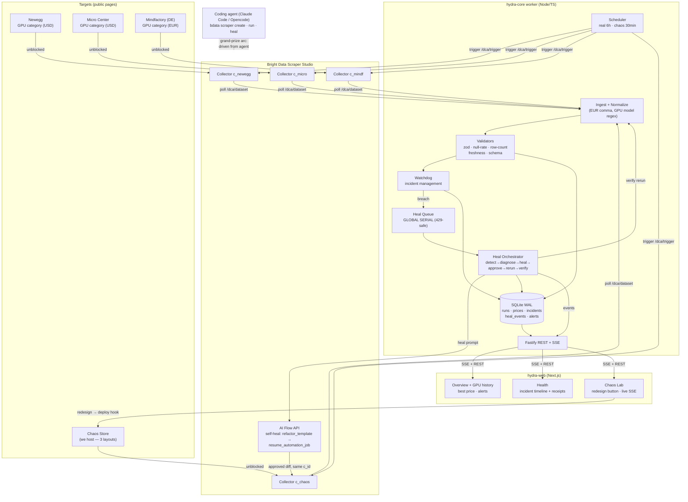

# HYDRA — Architecture Diagram (README-ready)
> Mermaid renders on GitHub natively. Also export PNG Aug 17 (mermaid.live) → docs/assets/architecture.png

## One-line data flow (for README text)
`stores → Bright Data collectors → worker ingest → validators → SQLite → dashboard · breach → watchdog → heal queue → AI Flow repair → verify → close`

## Three-track story (README section)
- **Web-Slinger**: collectors created/healed from coding agent via CLI + AI Flow; live chaos proof
- **Suit-Up**: zero-login dashboard, multi-currency price intel, live SSE chaos lab
- **Spider-Sense**: typed monorepo, event-sourced receipts, serial heal queue, honest failure logs
